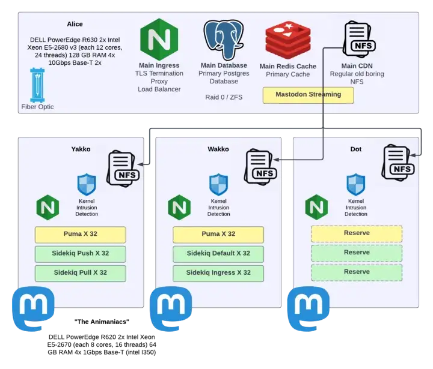
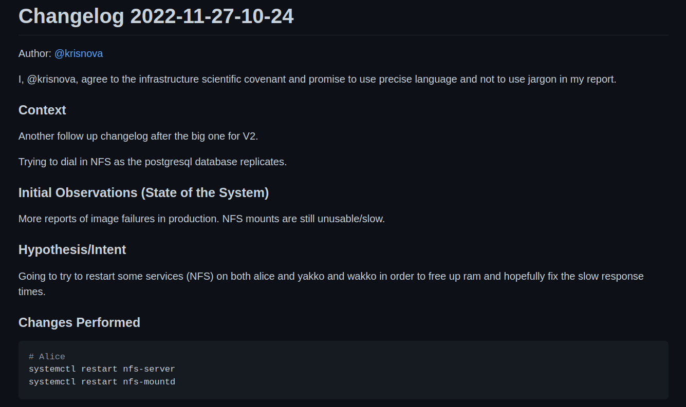
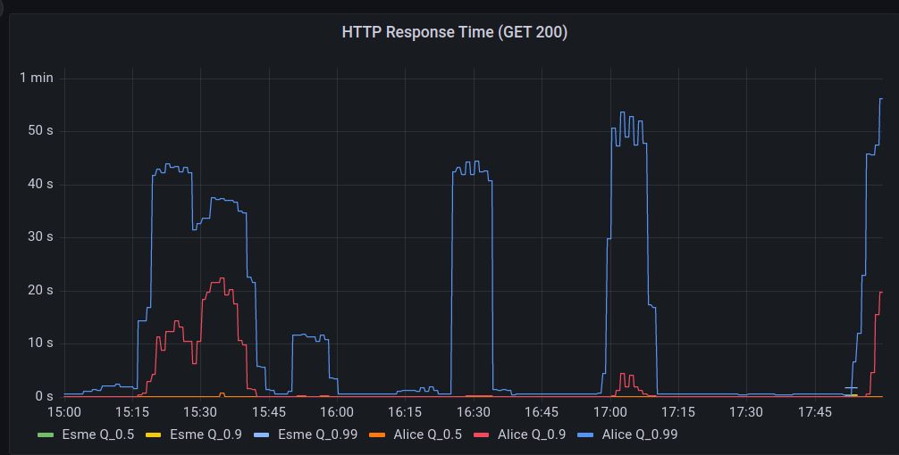
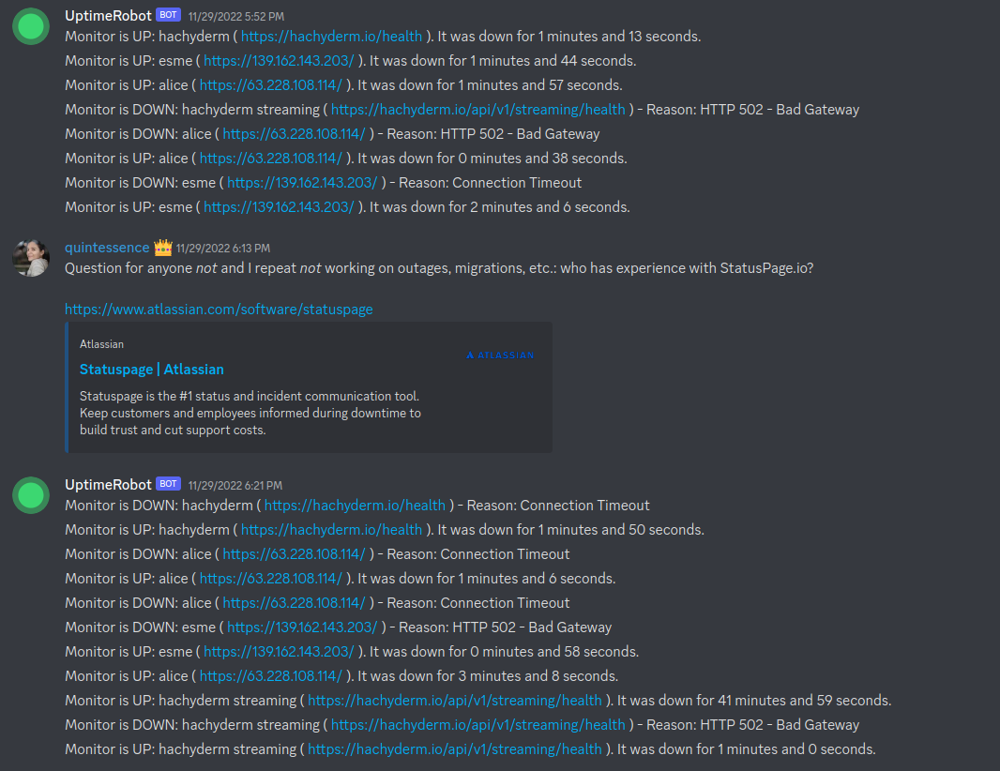
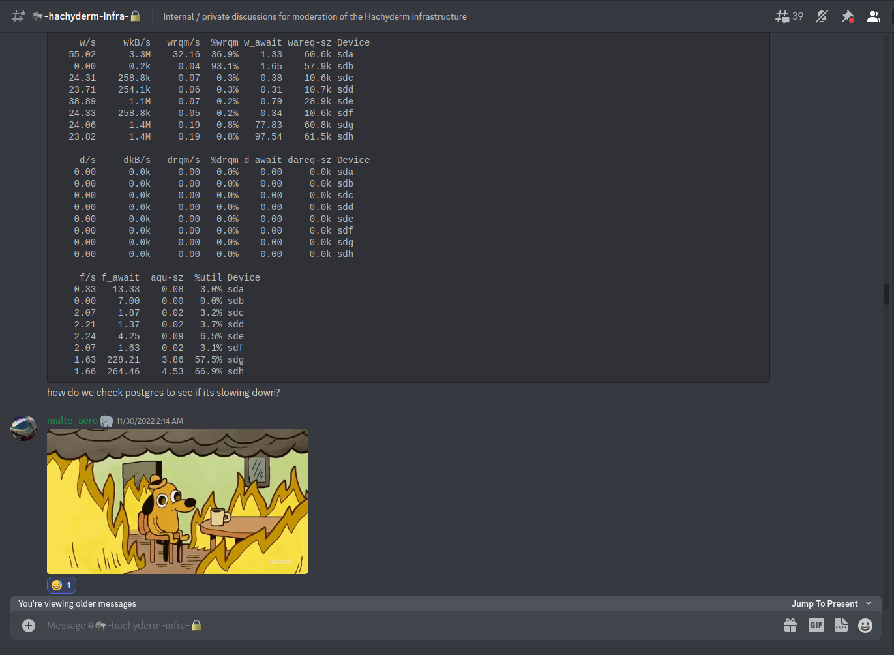
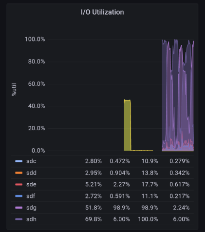

This post has taken several weeks in the making to compile.
My hope is that this captures the vast majority of questions people have been asking recently with regard to Hachyderm.

To begin, I would like to start by introducing the state of Hachyderm before the migration, as well as introduce the problems we were experiencing.
Next, I will cover the root causes of the problems, and how we found them.
Finally, I will discuss the migration strategy, the problems we experienced, and what we got right, and what can be better.
I will end with an accurate depiction of how hachyderm exists today.


Alice, our main on-premise server with her 8 SSDs. A 48 port Unifi Gigabit switch.


## State of Hachyderm: Before

Hachyderm obtained roughly 30,000 users in 30 days; or roughly 1 new user every 1.5 minutes for the duration of the month of November.

I documented 3 medium articles during the month, each with the assumption that it would be my last for the month. 

 - November 3rd, 720 users [Operating Mastodon, Privacy, and Content](https://medium.com/@kris-nova/operating-mastodon-privacy-and-content-399eef251e65)
 - November 13th, 6,000 users [Hachyderm Infrastructure](https://medium.com/@kris-nova/hachyderm-infrastructure-74f518bc7472)
 - November 25th, 25,000 users [Experimenting with Federation and Migrating Accounts](https://medium.com/@kris-nova/experimenting-with-federation-and-migrating-accounts-eae61a688c3c)

Here are the servers that were hosting Hachyderm in the rack in my basement, which later became known as "The Watertower".

|          | Alice                                                                | Yakko                                     | Wakko                                     | Dot                                       |
|----------|----------------------------------------------------------------------|-------------------------------------------|-------------------------------------------|-------------------------------------------|
| Hardware | DELL PowerEdge R630 2x Intel Xeon E5-2680 v3                         | DELL PowerEdge R620 2x Intel Xeon E5-2670 | DELL PowerEdge R620 2x Intel Xeon E5-2670 | DELL PowerEdge R620 2x Intel Xeon E5-2670 |
| Compute  | 48 Cores (each 12 cores, 24 threads)                                 | 32 Cores (each 8 cores, 16 threads)       | 32 Cores (each 8 cores, 16 threads)       | 32 Cores (each 8 cores, 16 threads)       |
| Memory   | 128 GB RAM                                                           | 64 GB RAM                                 | 64 GB RAM                                 | 64 GB RAM                                 |
| Network  | 4x 10Gbps Base-T 2x                                                  | 4x 1Gbps Base-T (intel I350)              | 4x 1Gbps Base-T (intel I350)              | 4x 1Gbps Base-T (intel I350)              |
| SSDs     | 238 GiB (sda/sdb) 4x 931 GiB (sdc/sdd/sde/sdf) 2x 1.86 TiB (sdg/sdh) | 558 GiB Harddrive  (sda/sdb)              | 558 GiB Harddrive  (sda/sdb)              |  558 GiB Harddrive  (sda/sdb)             |

It is important to note that all of the servers are used hardware, and all of the drives are SSDs.

"The Watertower" sat behind a few pieces of network hardware, including large business fiber connection in Seattle, WA. 
Here are the traffic patterns we measured during November, and the advertised limitations from our ISP.

|     | Egress Advertised | Egress in Practice | Ingress Advertised | Ingress in Practice |
|-----|-------------------|--------------------|--------------------|---------------------|
|     | 200 Mbps          | 217 Mbps           | 1 Gbps             | 112 Mbps            |

Our busiest traffic day was 11/21/22 where we processed 999.80 GiB in RX/TX traffic in a single day.
During the month of November we averaged 36.86 Mbps in traffic with samples taken every hour.

The server service layout is detailed below.



## Problems in Production

For the vast majority of November, Hachyderm had been stable. 
Most users reported excellent experience, and our systems remained relatively healthy.

On November 27th, I filed the 1st of what would become 21 changelogs for our production infrastructure.

The initial report was failing images in production. The initial investigation lead our team to discover that our NFS clients were behaving unreasonably slow.

We were able to prove that NFS was "slow" by trying to navigate to a mounted directory and list files.
In the best cases results would come back in less than a second. 
In the worst cases results would take 10-20 seconds.
In some cases the server would lock up and a new shell would need to be established; NFS would never return.



I filed a changelog, and mutated production. This is what became the first minor change in a week long crisis to evacuate the basement.

We were unable to fix the perceived slowness with NFS with my first change. 

However we did determine that we had scaled our compute nodes very high in the process of investigating NFS. Load averages on Yakko, Wakko, and Dot were well above 1,000 at this time.

Each Yakko, Wakko, and Dot were housing multiple systemd units for our ingress, default, push, pull, and mailing queues -- as well as the puma web server hosting Mastodon itself.

At this point Alice was serving our media over NFS, postgres, redis, and a lightweight Nginx proxy to load balance across the animaniacs (Yakko, Wakko, and Dot).

The problems began to cascade the night of the 27th, and continued to grow worse by the hour into the night. 

 - HTTP(s) response times began to degrade.
 - Postgres response times began to degrade.
 - NFS was still measurably slow on the client side.

The main observation was that the service would "flap", almost as if it was deliberately toying with our psychology and our hope.

 

We would see long periods of "acceptable" performance when the site would "settle down".
Then, without warning, our alerts would begin to go off.

Hachyderm hosts a network of edge or point of presence (PoP) nodes that serve as a frontend caching mechanism in front of core.

During the "spikes" of failure, the edge Nginx logs began to record "Connection refused" messages.


The trend of "flapping" availability continued into the night. 
The service would recover and level out, then a spike in 5XX level responses, and then ultimately a complete outage on the edge.

This continued for several days.



### A Note on Empathy

It is important to note that Hachyderm had grown organically over the month of November.
Every log that was being captured, every graph that was consuming data, every secret, every config file, every bash script -- all -- were a consequence of reacting to the "problem" of growth and adoption.

I call this out, because this is very akin to most of the production systems I deal with in my career.
It is important to have empathy for the systems and the people who work on them.
Every large production is a consequence of luck.
This means that something happened that caused human beings to flock to your service.

I am a firm believer that no system is ever "designed" for the consequences of high adoption.
This is especially true with regard to Mastodon, as most of our team has never operated a production Mastodon instance before.
To be candid, it would appear that most of the internet is in a similar situation.

We are all experimenting here. Hachyderm was just "lucky" to see adoption.

> There is no such thing as both a mechanistic and highly adopted system.
> All systems that are a consequence of growth, will be organic, and prone to the symptoms of reactive operations.

In other words, every ugly system is also a successful system.
Every beautiful system, has never seen spontaneous adoption.

## Finding Root Causes

By the 3rd day we had roughly 20 changelogs filed.

Each changelog capturing the story of a highly motivated and extremely hopeful member of the team believing they had once and for all identified the bottleneck.
Each, ultimately failing to stop the flapping of Hachyderm.

I cannot say enough good things about the team who worked around the clock on Hachyderm. In many cases we were sleeping for 4 hours a night, and bringing our laptops to bed with us.

 - [@Quintessence](https://hachyderm.io/@Quintessence) wins the "Universe's best incident commander" award.
 - [@Taniwha](https://hachyderm.io/@Taniwha)  wins the "Best late night hacker and cyber detective" award.
 - [@hazelweakly](https://hachyderm.io/@hazelweakly) wins the "Extreme research and googling cyberhacker" award.
 - [@malte](https://hachyderm.io/@malte) wins the "Best architect and most likely to remain calm in a crisis" award.
 - [@dma](https://hachyderm.io/@dma) wins the "Best scientist and graph enthusiast" award.

After all of our research, science, and detection work we had narrowed down our problem two 2 disks on Alice. 

```
/dev/sdg # 2Tb "new" drive
/dev/sdh # 2Tb "new" drive
```

The IOPS on these two particular drives would max out to 100% a few moments before the cascading failure in the rack would begin.
We had successfully identified the "root cause" of our production problems.

Here is a graphic that captures the moment well. Screenshot taken from 2am Pacific on November 30th, roughly 3 days after production began to intermittently fail.



It is important to note that our entire production system, was dependent on these 2 disks, as well as our ZFS pool which was managing the data on the disks,

```
[novix@alice]: ~>$ df -h
Filesystem                Size  Used Avail Use% Mounted on
dev                        63G     0   63G   0% /dev
run                        63G  1.7G   62G   3% /run
/dev/sda3                 228G  149G   68G  69% /
tmpfs                      63G  808K   63G   1% /dev/shm
tmpfs                      63G   11G   53G  16% /tmp
/dev/sdb1                 234G  4.6G  218G   3% /home
/dev/sda1                1022M  288K 1022M   1% /boot/EFI
data/novix                482G  6.5G  475G   2% /home/novix
data                      477G  1.5G  475G   1% /data
data/mastodon-home        643G  168G  475G  27% /var/lib/mastodon
data/mastodon-postgresql  568G   93G  475G  17% /var/lib/postgres/data
data/mastodon-storage     1.4T  929G  475G  67% /var/lib/mastodon/public/system
tmpfs                      10G  7.5G  2.6G  75% /var/log 
```

Both our main media block storage, and our main postgres database was currently housed on ZFS.
The more we began to correlate the theory, the more we could correlate slow disks to slow databases responses, and slow media storage. 
Eventually our compute servers and web servers would max out our connection pool against the database and timeout.
Eventually our web servers would overload the media server and timeout.

The timeouts would cascade out to the edge nodes and eventually cause:

 - 5XX responses in production.
 - Users hitting the "submit" button as our HTTP(s) servers would hang "incomplete" resulting in duplicate posts.
 - Connection refused errors for every hop in our systems.



We had found the root cause. Our disks on Alice were failing.

## Migration 1: Digital Ocean

We had made the decision to evacuate The Watertower and migrate to Hetzner weeks prior to the incident. 
However it was becoming obvious that our "slow and steady" approach to setting up picture-perfect infrastructure in Hetzner wasn't going to happen.

We needed off Alice, and we needed off now.

A few notable caveats about leaving The Watertower. 

1. Transferring data off The Watertower was going to take several days with the current available speed of the disks.
2. We were fairly confident that shutting down production for several days wasn't an option.
3. Our main problem was getting data off the disks.

Unexpectedly I received a phone call from an old colleague of mine [@Gabe Monroy](https://hachyderm.io/@gabe) at Digital Ocean.
Gabe offered to support Hachyderm altruistically and was able to offer the solution of moving our block storage to [Digital Ocean Spaces](https://try.digitalocean.com/cloud-storage) for object storage.

Thank you to Gabe Monroy, Ado Kukic, and Daniel Hix for helping us with this path forward! Hachyderm will forever be grateful for your support!

There was one concern, how were we going to transfer over 1Tb of data to Digital Ocean on already failing disks?

One of our infrastructure volunteers [@malte](https://hachyderm.io/@malte) had helped us come up with an extremely clever solution to the problem.

We could leverage Hachyderm's users to help us perform the most meaningful work first.

### Solution: NGINX try_files

Malte's model was simple: 

 1. We begin writing data that is cached in our edge nodes directly to the object store instead of back to Alice. 
 2. As users access data, we can ensure that it will be be taken of Alice and delivered to the user. 
 3. We can then leverage [Mastodon's S3 feature](https://docs.joinmastodon.org/admin/optional/object-storage-proxy/) to write the "hot" data directly back to Digital Ocean using a reverse Nginx proxy.

We can point the `try_files` directive back to Alice, and only serve the files from Alice once as they would be written back to S3 by the edge node accessing the files. [Read try_files documentation](http://nginx.org/en/docs/http/ngx_http_core_module.html#try_files).

In other words, the more that our users accessed Hachyderm, the faster our data would replicate to Digital Ocean.
Conveniently this also meant that we would copy the data that was being immediately used first.

We could additionally run a slow `rclone` for the remaining data that is still running 2+ days later as I write this blog post.

This was the most impressive solution I have seen to a crisis problem in my history of operating distributed systems.
Our users, were able to help us transfer our data to Digital Ocean, just by leveraging the service.
The more they used Hachyderm, the more we migrated off Alice's bad disks.

## Migration 2: Hetzner 

By the time the change had been in production for a few hours, we all had noticed a substantial increase in our performance.
We were able to remove NFS from the system, and shuffle around our Puma servers, and sidekiq queues to reduce load on Postgres. 

Alice was serving files from the bad disks, however all of our writes were now going to Digital Ocean.

While our systems performance did "improve" it was still far from perfect. 
HTTP(s) requests were still very slowly, and in cases would timeout and flap. 

At this point it was easy to determine that Postgres (and it's relationship to the bad disks) was the next bottleneck in the system.

**Note**: _We still have an outstanding theory that ZFS, specifically the unbalanced mirrors, is also a contributing factor. We will not be able to validate this theory until the service is completely off Alice._

It would be slightly more challenging coming up with a clever solution to get Postgres off Alice.

On the morning of December 1st we finished replicating our postgres data across the atlantic onto our new fleet of servers in Hetzner.

 - Nixie (Alice replacement)
 - Freud (Yakko)
 - Fritz (Wakko)
 - Franz (Dot)

We will be publishing a detailed architecture on the current system in Hetzner as we have time to finalize it.

Our team made an announcement that we were shutting production down, and scheduled a live stream to perform the work.

The video of the cutover is [available to watch directly on Twitch](https://www.twitch.tv/videos/1667526014).


### NodeJS and Mastodon

The migration would not be complete without calling out that I was unable to build the Mastodon code base on our new primary Puma HTTP server.

After what felt like an eternity we discovered that we needed to recompile the NodeJS assets.

```bash
cd /var/lib/mastodon
NODE_OPTIONS=--openssl-legacy-provider
RAILS_ENV=production bundle exec rails assets:precompile
```

Eventually we were able to build and bring up the Puma server which was connected to the new postgres server.

We moved our worker queues over to the new servers in Hetzner.

The migration was complete.

## State of Hachyderm: After

To be candid, Hachyderm "just works" now and we are serving our core content within the EU in Germany.

There is an ever-growing smaller and smaller amount of traffic that is still routing through Alice as our users begin to access more and more obscure files.

Today we have roughly 700Gb of out 1.2Tb of data transferred to Digital Ocean.

We will be destroying the ZFS server in Alice, and replacing the disks as soon as we can completely take The Watertower offline.

On our list of items to cover moving forward:

 - [ ] Offer a detailed public resource of our architecture in Hetzner complete with Mastodon specific service breakdowns.
 - [X] Build a blog and community resource such that we can begin documenting our community and bringing new volunteers on board.
 - [ ] Take a break, and install better monitoring on our systems.
 - [ ] Migrate to NixOS or Kubernetes depending on the needs of the system.
 - [ ] Get back to working on Aurae, now with a lot more product requirements than we had before.

## Conclusion 

We suffered from pretty common pitfalls in our system. 
Our main operational problems stemmed from scaling humans, and not our knowledge of how to build effective distirbuted systems.
We have observability, security, and infrastructure experts from across Silicon Valley working on Hachyderm and we were still SSHing into production and sharing passwords.

In other words, our main limitations to scale were managing people, processes, and organizational challenges.
Even determining who was responsible for what, was a problem within itself.

We had a team of experts without any formal precedent working together, and no legal structure or corporate organization to glue us together.
We defaulted back to some bad habits in a pinch, and also uncovered some exciting new patterns that were only made possible because of the constraints of the fediverse.

Ultimately I believe that myself, and the entire team is convinced that the future of the internet and social is going to be in large collaborative operational systems that operate in a decentralized network.

We made some decisions during the process, such as keeping registrations open during the process that I agree with. I think I would make the same decisions again.
Our limiting factor in Hachyderm had almost nothing to do with the amount of users accessing the system as much as it did the amount of data we were federating.
Our system would have flapped if we had 100 users, or if we had 1,000,000 users. We were nowhere close to hitting limits of DB size, storage size, or network capacity. We just had bad disks.

I think the biggest risk we took was onboarding new people to a slow/unresponsive service for a few days. I am willing to accept that as a good decision as we are openly experimenting with this entire process. 

I have said it before, and I will say it again. I believe in Hachyderm. I believe we can build a beautiful and effective social media service for the tech industry.

The key to success will be how well we experiment. This is the time for good old fashioned computer science, complete with thoughtful hypothesis and detailed observability to validate them.

